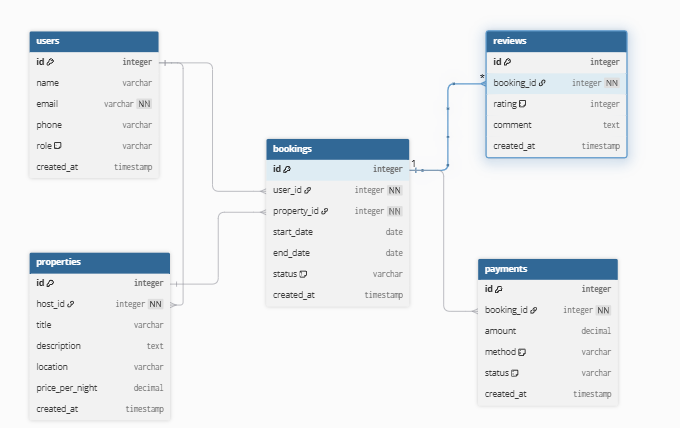

# Database Normalization

## Objective
The goal of normalization is to optimize the Airbnb-like database design by reducing redundancy, ensuring data integrity, and structuring data in a way that supports scalability. The schema has been normalized up to **Third Normal Form (3NF)**.

---

## 1. First Normal Form (1NF)
**Definition:** A table is in 1NF if:
- All attributes are atomic (no repeating groups, no arrays).
- Each record is unique.

**Application:**
- All tables (`users`, `properties`, `bookings`, `payments`, `reviews`) have primary keys (`id`) that uniquely identify each record.
- Attributes such as `email`, `phone`, `location`, and `price_per_night` hold single values only.
- No repeating columns or multi-valued attributes exist.

✔️ **Our design satisfies 1NF.**

---

## 2. Second Normal Form (2NF)
**Definition:** A table is in 2NF if:
- It is already in 1NF.
- Every non-key attribute depends on the whole primary key (no partial dependency).

**Application:**
- All tables use a single-column primary key (`id`), so partial dependency is not possible.
- Example: In `bookings`, attributes like `start_date`, `end_date`, and `status` depend entirely on `id` and not on a part of it.

✔️ **Our design satisfies 2NF.**

---

## 3. Third Normal Form (3NF)
**Definition:** A table is in 3NF if:
- It is already in 2NF.
- There are no transitive dependencies (non-key attributes should not depend on other non-key attributes).

**Application:**
- In `users`, non-key attributes (`name`, `email`, `phone`, `role`, `created_at`) all depend only on `id`.
- In `properties`, attributes (`title`, `description`, `location`, `price_per_night`) depend only on `id`. The `host_id` is a foreign key to `users.id`, which is acceptable.
- In `bookings`, attributes (`user_id`, `property_id`, `start_date`, `end_date`, `status`) depend only on `id`.
- In `payments`, attributes (`amount`, `method`, `status`, `created_at`) depend only on `id`.
- In `reviews`, attributes (`rating`, `comment`, `created_at`) depend only on `id`.

No attribute indirectly depends on another non-key attribute (e.g., no case like `zipcode → city → state`).

✔️ **Our design satisfies 3NF.**

---

## Conclusion
The database schema has been normalized through:
1. **1NF** – Removing repeating groups and ensuring atomic values.  
2. **2NF** – Eliminating partial dependencies.  
3. **3NF** – Eliminating transitive dependencies.  

The final normalized design ensures minimal redundancy, maintains data integrity, and supports scalability for an Airbnb-like application.

---

## ER Diagram Reference
The normalized ERD can be found here:  

---
